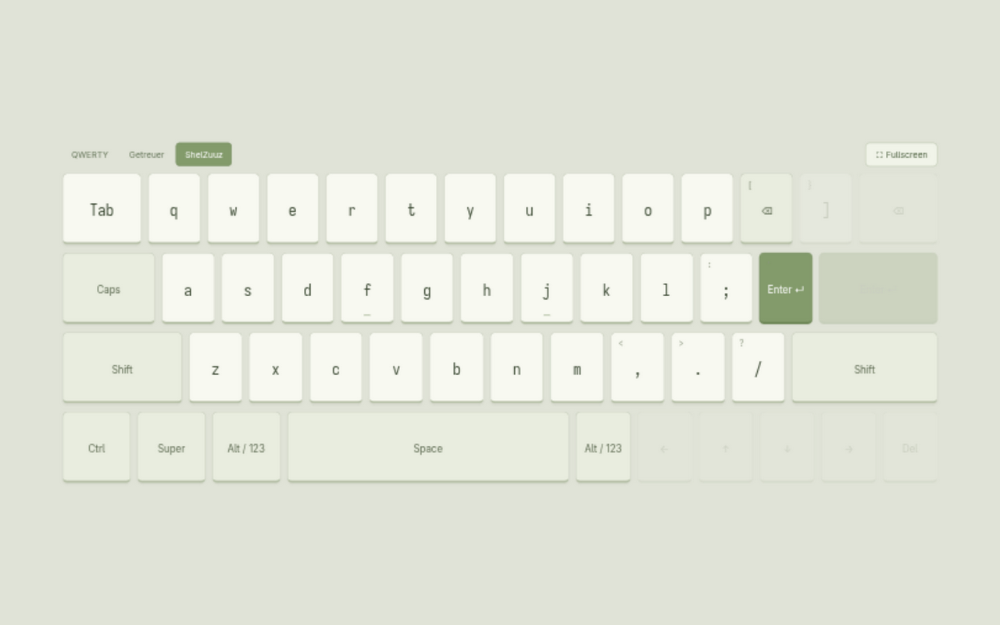
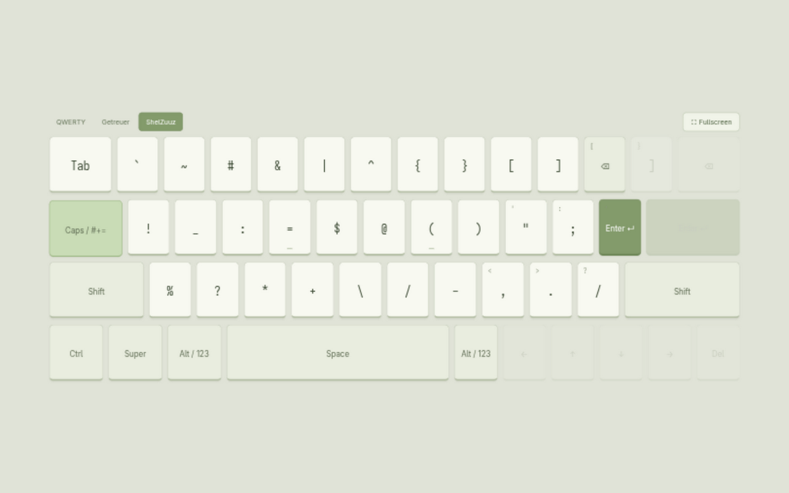
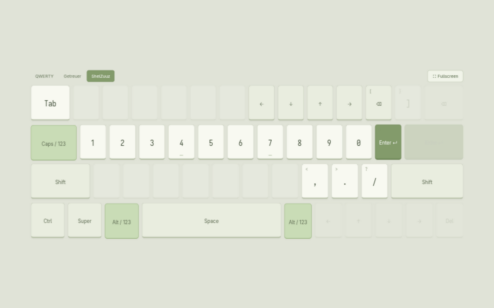

# jrtilak-layout

A personal QWERTY layout with nearby symbols, home-row numbers, and short-reach
Backspace/Enter. It adapts the ShelZuuz layout tried in the
`~/coding/exp/keyboard-layout` website. Kanata remaps the physical keyboard at the
Linux input level; Hyprland continues to use US QWERTY to interpret its output.

## Switching layers

| Action | Result |
| --- | --- |
| Start | ABC |
| Tap Caps once | Symbols for one key, then return to the previous ABC or Numbers layer |
| Tap Caps twice within 320 ms | Toggle persistent Numbers ↔ ABC |
| Tap Caps again after 320 ms while Symbols is pending | Cancel Symbols and return to the previous layer |
| Hold Shift/Ctrl/Alt/Super | Normal modifier; does not consume the pending symbol |

There is no timeout for the pending symbol. Pressing another usable typing key,
including Space, Tab, Backspace, Enter, Escape or a navigation/function key,
consumes it. Disabled keys do nothing. Caps is a layer key, so it no longer
activates Caps Lock or Compose. Tab remains ordinary Tab; Alt remains ordinary
Alt on the physical keyboard.

## ABC

Letters stay in their standard QWERTY positions. Modifiers stay at their actual
physical positions. These nearby editing positions stay the same in every layer:

| Physical key | Output |
| --- | --- |
| `[` (immediately right of P) | Backspace |
| `'` (immediately right of semicolon) | Enter |
| `; , . /` | Normal punctuation, including their Shift variants; semicolon becomes 0 in Numbers |



## Symbols

Only letter positions receive symbol overrides. Read each row against the
ordinary QWERTY letters underneath it:

```text
Physical:  Q W E R T   Y U I O P
Output:    ` ~ # & |   ^ { } [ ]

Physical:  A S D F G   H J K L
Output:    ! _ : = $   @ ( ) "

Physical:  Z X C V B   N M
Output:    % ? * + \   / -
```

Shift+L supplies apostrophe instead of double quote. Other letter-position
symbols produce the shown character even with Shift held. Shift+comma/period
still supplies `<`/`>` at their usual positions. For example: Caps, U types `{`
and returns to ABC; Caps, Shift+L types `'`.



## Numbers

```text
Physical:  A S D F G H J K L ;
Output:    1 2 3 4 5 6 7 8 9 0

Physical:  U I O P
Output:    ← ↓ ↑ →
```

The physical top-row 1–0 keys work in every layer and always output digits,
even with Shift held. In Symbols, using a top-row digit also consumes the
one-shot layer and returns to the previous layer.

Other letter positions are disabled in Numbers. Digits stay digits with Shift
held. Comma, period and slash remain available. For example: Caps twice, A S D
types `123`; Caps, V inserts `+` and returns to Numbers; F types `4`.



These are screenshots of the existing tablet prototype. Its clickable Alt/123
controls remain an alternate way to preview Numbers; the physical layout uses
Caps taps and leaves Alt available for application shortcuts.

## Disabled keys while the layout is active

Grave, minus, equals, the original far-right Backspace/Enter, right bracket and
backslash are disabled in every layer. Use the nearby editing positions and
symbol layer instead. Top-row 1–0 remain available, including with Ctrl, Alt or
Super for shortcuts; Shift is suppressed for these digits.

This restriction covers the main typing block. Escape, F1–F12, dedicated
navigation keys, modifiers, media keys and a separate numpad are retained.
Disabling the layout restores every original key.

## Flags and applying changes

Edit [`flags.env`](../../keyboard/.config/jrtilak-layout/flags.env), linked at
`~/.config/jrtilak-layout/flags.env`:

```sh
JRTILAK_DISABLE_COMPOSE=1
JRTILAK_LAYOUT=1
```

| Disable Compose | Layout | Behavior |
| --- | --- | --- |
| 1 | 1 | jrtilak-layout; Caps controls layers |
| 1 | 0 | Standard keyboard; Caps Lock, no Compose |
| 0 | 0 | Standard keyboard with Omarchy's original Caps-as-Compose |
| 0 | 1 | jrtilak-layout; Compose suppressed because Caps controls layers |

Run `jrtilak-layout apply` after editing. The shared env file is read by both
Hyprland and the service; it takes precedence over inherited environment values.
The original `compose:caps` configuration is retained in the `else` branch of
[`input.lua`](../../hypr/.config/hypr/input.lua). Existing Compose sequences in
`~/.XCompose`, including Omarchy's include, are preserved.

```sh
jrtilak-layout status # flags and service state
jrtilak-layout stop   # immediately restore physical QWERTY until restarted
```

Emergency exit: press physical **Left Ctrl + Space + Escape** together. Kanata
exits and releases the keyboard; the service does not automatically restart.
For a lasting rollback, set `JRTILAK_LAYOUT=0` and run `jrtilak-layout apply`.
Also set `JRTILAK_DISABLE_COMPOSE=0` to restore Omarchy Compose.

## Installation and tracked files

From this repository on x86_64 Linux, run `bash keyboard/install.sh`. It requires
curl, unzip, GNU Stow, systemd, udev and an active Hyprland session. The installer
downloads Kanata **v1.12.0**, verifies the pinned release archive SHA-256, installs
the binary in `~/.local/bin`, links the `hypr` and `keyboard` Stow packages, and
enables the user service. Stow reports conflicting pre-existing files rather
than overwriting them; move those files aside after reviewing them if needed.

The configuration, flags, launcher, installer and service definition are all
tracked here. The executable download is not committed. Device access uses an
additive `/etc/udev/rules.d/70-jrtilak-layout.rules`, copied from its tracked
source in `keyboard/.config/jrtilak-layout/`. This grants the active desktop user
keyboard and uinput access. No packaged Omarchy configuration is modified.

The user service starts with the graphical session and captures attached
keyboards, including hotplugged devices. Login before the graphical session
uses the normal keyboard. The three user-facing layers use four internal Kanata
states so Symbols can remember whether to return to ABC or Numbers.

## References

- [ShelZuuz's original discussion](https://www.reddit.com/r/KeyboardLayouts/comments/1kdfg92/)
- [Getreuer's symbol-layer comparison](https://getreuer.info/posts/keyboards/symbol-layer/index.html#shelzuuzs-symbol-layer)
- [Kanata v1.12.0 configuration reference](https://github.com/jtroo/kanata/blob/v1.12.0/docs/config.adoc)
